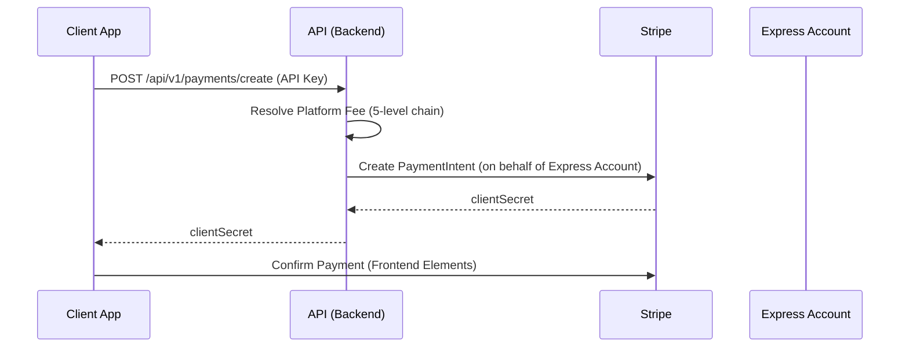
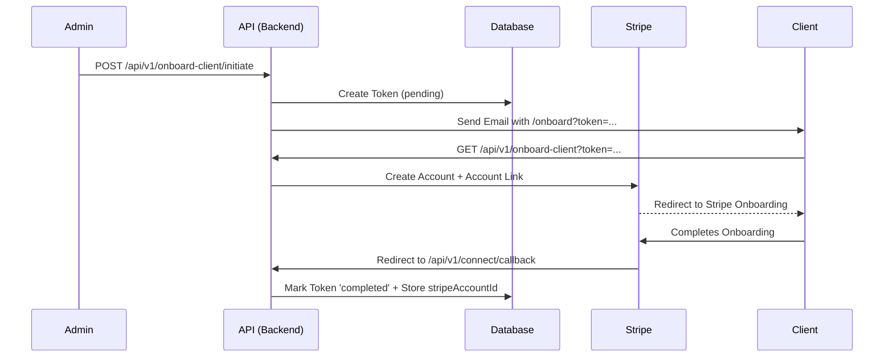

# System Architecture - DFWSC Payment Portal

This document outlines the architectural design and technical foundations of the DFWSC Payment Portal.

## 1. High-Level Overview
The DFWSC Payment Portal is a platform for DFW Software Consulting to manage client payments and subscriptions via **Stripe Connect**. It allows consultants to onboard clients into Stripe Express accounts, process one-time payments, and manage recurring invoices.

## 2. Tech Stack
- **Frontend:** React 18, Vite, React Router 6, TanStack Query v5, TailwindCSS v4.
- **Backend:** Node.js 20, Fastify 5, TypeScript.
- **Database:** PostgreSQL 17, Drizzle ORM.
- **Integrations:** Stripe Connect (Express), Nodemailer (SMTP).
- **Environment:** Docker (Multi-stage builds), Nginx (Reverse proxy for frontend).

## 3. Specialized Documentation
For detailed rules and implementations, refer to these focused documents:
- [BACKEND.md](./BACKEND.md) — API, Auth, Flows, and Logic.
- [DATABASE.md](./DATABASE.md) — Schema, Drizzle, and Migrations.
- [STYLES.md](./STYLES.md) — Tailwind v4, Theme, and UI Patterns.
- [CRM.md](./CRM.md) — Lead pipeline, client lifecycle, and payment sync job.

## 4. System Components
...

## 4. Key Architectural Flows

### Payment Flow (Stripe Connect)

### Onboarding Flow

## 5. Data Model (Drizzle/PostgreSQL)
- **`clients`**: Primary entity. Covers both leads (`status="lead"`, no Stripe ID) and active/inactive clients. Includes CRM columns: `paymentStatus`, `paymentStatusSyncedAt`, `suspendedAt`, `suspensionReason`.
- **`client_groups`**: Shared configuration (fees, success URLs) for multiple clients.
- **`onboarding_tokens`**: Lifecycle management for Stripe Connect onboarding.
- **`subscriptions`**: Recurring payment configurations.
- **`invoices`**: Individual billing records linked to clients or subscriptions.
- **`webhook_events`**: Idempotency log for Stripe webhooks.

## 6. Security & Authentication
- **Admin Access:** JWT-based authentication (`POST /api/v1/auth/login`).
- **Client Access:** API Key authentication (`X-Api-Key`).
    - Uses `apiKeyLookup` (SHA256) for lookup and `apiKeyHash` (bcrypt) for verification.
- **CSRF Protection:** State-based validation for Connect callbacks.
- **Rate Limiting:** Sliding-window per IP/Account ID.

## 7. Architectural Rules
- **Backend Strategy:** **Layered Architecture**.
  - **Routes (`src/routes/`)**: Acts as the Controller layer, handling HTTP request validation and response formatting.
  - **Lib (`src/lib/`)**: The Service layer, containing the core business logic, Stripe integrations, and shared utilities.
  - **DB (`src/db/`)**: The Data layer, defining the PostgreSQL schema via Drizzle ORM.

## 8. Styling & UI Patterns
The project uses a modern, dark-themed aesthetic with high-contrast brand accents.

- **Framework:** **TailwindCSS v4** (using the new `@theme` and `@import "tailwindcss"` syntax).
- **Design System:**
  - **Primary Background:** `bg-slate-950` (Dark Navy/Black).
  - **Brand Colors:** A custom `brand` scale (Teal/Cyan) defined in `index.css` (primary: `brand-500` - `#0b7285`).
  - **Glassmorphism:** Frequent use of `backdrop-blur-xl`, `bg-white/10` borders, and `shadow-[..._rgba(11,114,133,0.6)]` for depth.
- **Component Architecture:**
  - **Pill UI:** Reusable "pill" button styles (rounded-full, thin borders, hover glows).
  - **Hybrid Styling:** Prefer Tailwind utility classes for layout/spacing; use component-specific `.css` files only for complex animations (e.g., `Banner.css`).

## 9. Development & Tooling
- **Agent Entry Point:** `CLAUDE.md` (and its mirrors `Gemini.md`, `Qwen.md`) contains operational commands.
- **Linting/Formatting:** Biome (auto-fixes on commit).
- **Testing:** Vitest for backend; React Testing Library for frontend.
- **Migrations:** Drizzle-kit for schema generation and application.
