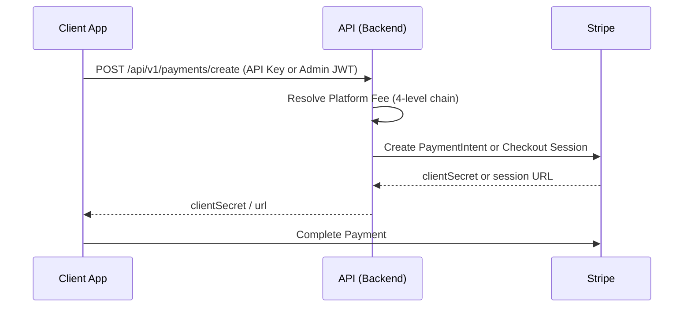
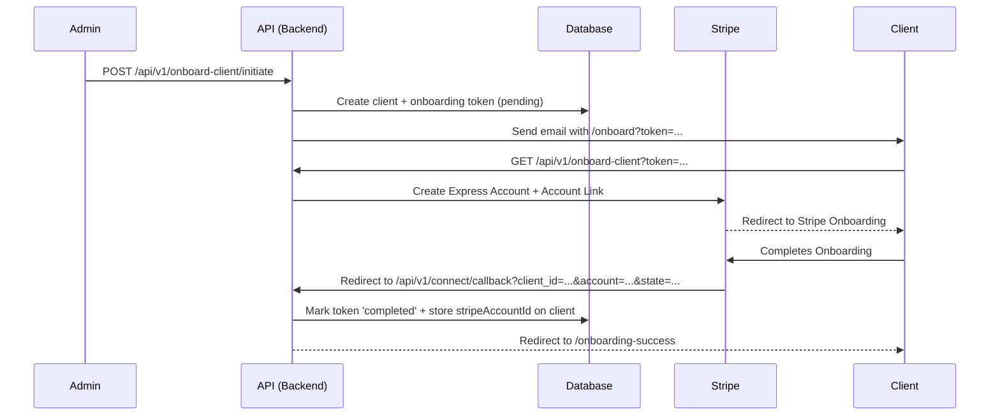

# System Architecture - DFWSC Payment Portal

This document outlines the architectural design and technical foundations of the DFWSC Payment Portal.

## 1. High-Level Overview
The DFWSC Payment Portal is a platform for DFW Software Consulting to manage client payments via **Stripe Connect**. It allows admins to onboard clients into Stripe Express accounts, process one-time payments, and manage client billing configuration. The same app also serves as the DFWSC public-facing marketing site (home, pricing, team, docs).

## 2. Tech Stack
- **Frontend:** React 18, Vite, React Router 6, TanStack Query v5, TailwindCSS v4.
- **Backend:** Node.js 20, Fastify 5, TypeScript.
- **Database:** PostgreSQL 17, Drizzle ORM.
- **Integrations:** Stripe Connect (Express), Nodemailer (SMTP).
- **Environment:** Docker (multi-stage builds), Nginx (reverse proxy for frontend).

## 3. Specialized Documentation
- [BACKEND.md](./BACKEND.md) — API, Auth, Flows, and Logic.
- [DATABASE.md](./DATABASE.md) — Schema, Drizzle, and Migrations.
- [STRIPE.md](./STRIPE.md) — Connect, Webhooks, and Payments.
- [STYLES.md](./STYLES.md) — Tailwind v4, Theme, and UI Patterns.
- [COOLIFY_DEPLOYMENT.md](./COOLIFY_DEPLOYMENT.md) — Production deployment on Coolify.

## 4. Key Architectural Flows

### Payment Flow (Stripe Connect)

### Onboarding Flow

## 5. Data Model (Drizzle/PostgreSQL)
- **`clients`**: Primary entity. `workspace` is always `"client_portal"`. `status` is `active`, `inactive`, `pending`, or `failed`.
- **`client_groups`**: Shared fee/URL configuration for multiple clients.
- **`onboarding_tokens`**: Lifecycle management for Stripe Connect onboarding. Statuses: `pending`, `in_progress`, `completed`, `revoked`.
- **`webhook_events`**: Idempotency log for Stripe webhooks.
- **`admins`**: Admin accounts with hashed passwords.
- **`settings`**: Key-value store for system-wide configuration (e.g., `company_name`).

## 6. Security & Authentication
- **Admin Access:** JWT Bearer token obtained from `POST /api/v1/auth/login`.
- **Client Access:** `X-Api-Key` header — `apiKeyLookup` (SHA256) for fast DB lookup + `apiKeyHash` (bcrypt) for verification.
- **CSRF Protection:** State-based validation for Connect callbacks (32-byte random token, 30-minute expiry).
- **Rate Limiting:** In-memory sliding-window per IP.

## 7. Architectural Rules
- **Layered Architecture:**
  - **Routes (`src/routes/`)**: Controller layer — HTTP validation and response shaping.
  - **Lib (`src/lib/`)**: Service layer — business logic, Stripe integrations, utilities.
  - **DB (`src/db/`)**: Data layer — PostgreSQL schema via Drizzle ORM.

## 8. Styling & UI Patterns
The project uses a dual light/dark theme with a teal brand accent.

- **Framework:** TailwindCSS v4 (`@import "tailwindcss"` + `@theme` block in `index.css`).
- **Theming:** CSS custom properties on `:root` (light) and `.dark` — `--bg-main`, `--bg-surface`, `--text-main`, `--text-muted`, `--glass-bg`, `--glass-border`.
- **Brand Colors:** `brand-50` through `brand-700` (primary: `brand-500` = `#0b7285`).
- **Glassmorphism:** `.glass` and `.glass-dark` utility classes for blurred translucent surfaces.

## 9. Development & Tooling
- **Linting/Formatting:** Biome.
- **Testing:** Vitest (backend integration tests); React Testing Library (frontend).
- **Migrations:** Drizzle-kit (`npm run db:generate` / `npm run db:migrate`).
- **Swagger:** Enabled when `ENABLE_SWAGGER=true` (dev only). UI available at `/docs`.
